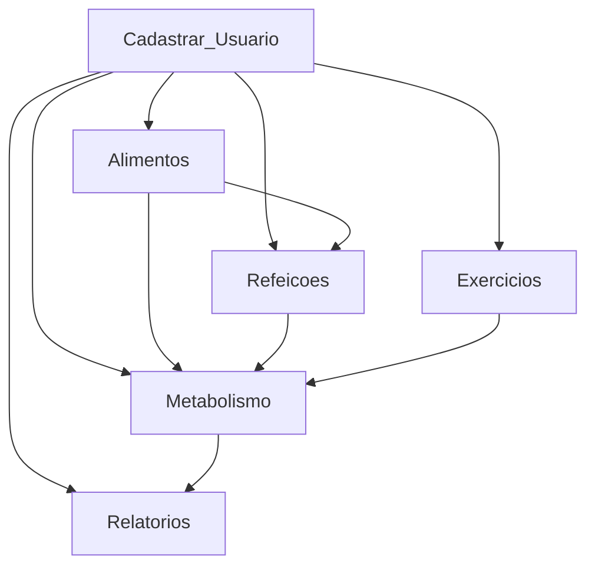

# AppDietas.api 🍏💪

Bem-vindo ao AppDietas, o seu parceiro de confiança na jornada para uma vida mais saudável e equilibrada! Este aplicativo incrível foi desenvolvido para tornar a sua experiência de dieta divertida, motivadora e eficaz. Prepare-se para embarcar em uma jornada transformadora rumo ao seu melhor eu!

## 🌟 Recursos Incríveis

### 📅 Planejamento Personalizado
- Crie planos de dieta personalizados com base nos seus objetivos.
- Estabeleça metas realistas e atinja resultados surpreendentes.

### 🥗 Banco de Receitas Saudáveis
- Explore uma variedade de receitas deliciosas e saudáveis.
- Adicione facilmente os ingredientes ao seu planejamento diário.

### 🏋️‍♂️ Rotinas de Exercícios
- Acesse rotinas de exercícios adaptadas às suas preferências e nível de condicionamento físico.
- Acompanhe o seu progresso e celebre cada conquista.

### 📊 Estatísticas e Gráficos
- Visualize seu progresso através de gráficos intuitivos.
- Mantenha-se motivado com estatísticas detalhadas sobre suas conquistas.

### 🛒 Lista de Compras Inteligente
- Simplifique suas compras com uma lista inteligente baseada no seu plano de dieta.
- Economize tempo e dinheiro enquanto mantém uma despensa saudável.

## Módulos

### 1. Cadastro
- Cadastrar Usuário
- Gerenciar Perfil

### 2. Alimentos
- Pesquisar Alimentos
- Adicionar Alimento
- Registrar Refeição

### 3. Refeições
- Gerenciar Refeição
- Visualizar Refeição

### 4. Informações Nutricionais
- Acompanhar Calorias
- Monitorar Nutrientes

### 5. Exercícios
- Adicionar Exercício
- Registrar Atividade Física

### 6. Metabolismo
- Ajustar Metabolismo
- Calcular Taxa Metabólica Basal (TMB)

### 7. Relatórios
- Gerar Relatórios
- Visualizar Progresso

### 8. Notificações
- Configurar Notificações
- Lembretes

### 9. Comunidade
- Fórum de Discussão
- Compartilhar Conquistas

### 10. Integrações
- Integração com Dispositivos
- Conectar a Apps de Saúde

### 11. Segurança
- Autenticação
- Privacidade dos Dados

